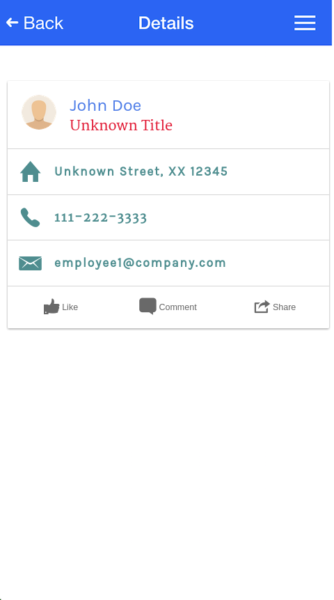

- - - 
# Introduction

In this set of labs we will demonstrate how to take an existing Ionic/Corodva application and import it into a MobileFirst Platform application, then demonstrate some of the capabilities provided by MobileFirst.  We will cover bootstrapping, using adapters

The activity will start with an Ionic project that we have already created (see git repo below).  The application is an Employee Directory application, named IBMTechEXEmployee.

The following exercise includes 9 micro labs (~15 min each)

- Lab # 1 - Creating Cordova hybrid base application with MFP CLI
- Lab # 2 - Import your existing Ionic/Angular code to MFP App
- Lab # 3 - Load MFP framework and application Bootstrapping
- Lab # 4 - Preview your application and adding MFP Backend project
- Lab # 5 - Using MFP adapters frameworks (Server Side)
- Lab # 6 - Using MFP adapters frameworks (Client side)
- Lab # 7 - Overview MFP Operational Analytics
- Lab # 8 - How to capture custom events
- Lab # 9 - How to create custom charts

### Source code for labs

In order to get the latest code for the ionic application, run the following git command:

     git clone https://github.com/eliranbi/MobileRoadShow7.1.git

Once you clone the repo you will notice the following directories :

- **IBMTechExBackEnd** - Is our MFP/Cordova completed directory application.

- **IBMTechEXEmployee** - Is MFP backend project that contains the adapters which implement the back-end integration code.

- **IonicApp** - Is our base Ionic Application that we are going to import into MFP.

In later steps, a **/snippets** folder will be added here, during a git checkout step.  This folder will contain a collection of copy/paste fragments to simplify making the required source code changes in the labs. They are labeled by lab name and task, and should be easy to locate and use. 

### Tools used in labs

In this lab we will use the following tools :

1. The MFP Command Line Interface (CLI) to interact with the MobileFirst Plaform, create projects, create adapters, deploy to the mfp server, view our mfp console etc.
2. Your choice of IDE to edit the code.  The Brackets IDE was used throughout these labs and can be downloaded from here :  <http://brackets.io>.  Brackets is a modern, open source text editor that understands web design.
You can also use the Brackets Extension manager to install additional plugins for code assistant and live preview , the one that I’m using in this tutorial is :

     - ionic-brackets.
     - Ionic Framework Code Hinting.
     - Brackets Beautify

  

### Preview the Ionic app

Lets start with preview our existing Ionic Employee Directory application.

1. Start Brackets and choose “Open folder” and select the IonicApp folder.

  

2. Use the Brackets file Navigator to locate and click on **IonicApp/www/index.html**.
3. Click the **lighting** icon in the upper right portion of the Brackets window to preview the completed application in the browser.

  

  You can use any combination of user name and password to login
   
  

### Summary

You now have the completed and operational Ionic application in your initial workspace.  In the next lab we will reset our workspace to a known starting point using 'git checkout'.  In later labs you will be able to use 'git checkout' to get the working project code, in case you get into trouble.

