- - -
# Lab 10 - Build a StrongLoop API

To complete this lab, you will need a StrongLoop account and the StrongLoop CLI.  Please use the following URL and instructions there to register for free account and download the StrongLoop CLI (as necessary - see Setup Steps section below for details)

     https://strongloop.com/get-started/

**NOTE: If using the supplied VMware image, StrongLoop has already been installed.**

## Steps:
### Setup StrongLoop Environment

1. Register for a StrongLoop account

   * If you haven’t already done so, register for an account on strongloop.com.    **An account will be required to use the ARC tools, so please register.**


2. Install Node.js

   * **If using the supplied VMware image, this has already been done.**  If you haven’t already done so, install Node.js.  
     
3. Install StrongLoop

   * **If using the supplied VMware image, this has already been done.**  You can install StrongLoop by executing the following command: 

     $ npm install -g strongloop

       Run into a snag? Check out the Strongloop installation troubleshooting guide.

### Create Loopback application

1. Change your directory to the root of the project.

        cd ~/MobileRoadShow7.1
          
2. Create a StrongLoop Application, run the following command :

        slc loopback

  Enter the name of your application : **SLTechExEmployee**

  Enter the directory to contain your project : **SLTechExEmployee**

  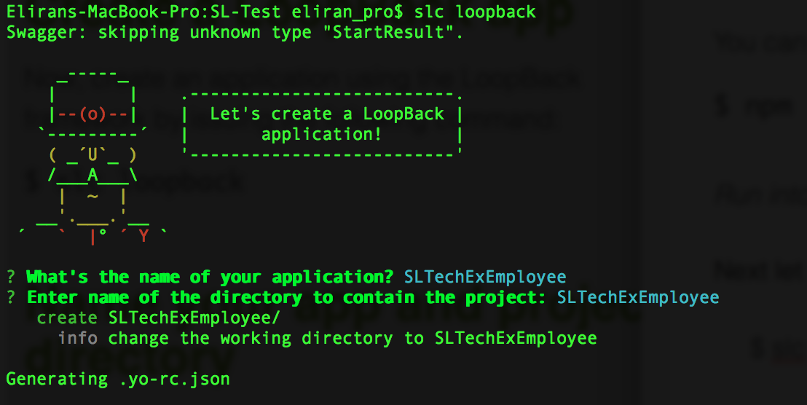

  StrongLoop will automatically install few node modules for datasource, express, etc...  Once the process has finished you can explore the new project folder that was created in the SLTechExEmployee directory.

  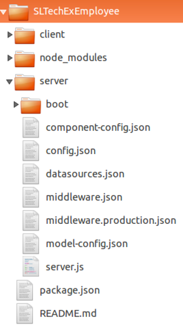

### Start StrongLoop Arc

Now lets start the StrongLoop Arc tool. 

1. Change the directory to the SLTechExEmployee

        cd SLTechExEmployee

2. Run the following command to start Arc:

        slc arc

    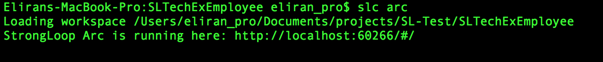

3. Your default browser will start and will display the StrongLoop Arc web interface.  Log in with your Strongloop username and password.

  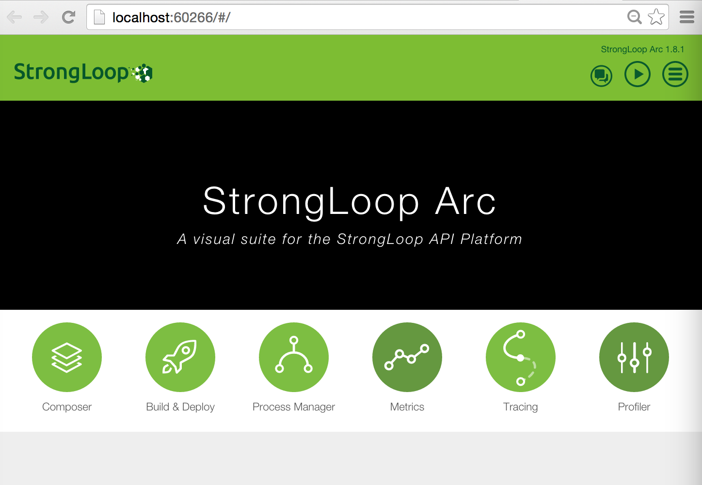

  We will use the Arc Composer tool to create our data models and then easily generate a Rest-API

4. Click the **Composer** button.

  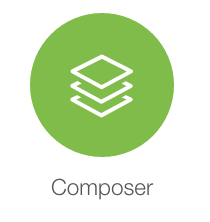

  As you can see the composer enables you to easily create a new datasource for Oracle, MS SQL, etc. In this exercise we are going to use the in-memory connector "db", which is created by default for you

  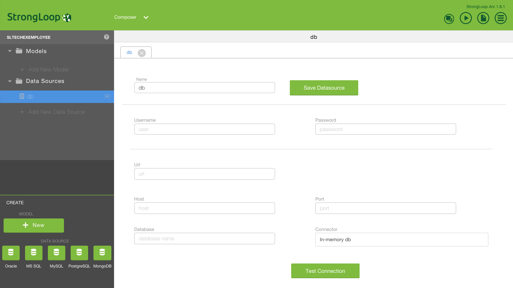


### Create data model with Arc Composer

1. Create a new Model. Click **+ Add New Model**

  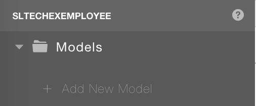

2. Name the data model **employee**.  Note that the Data Source **db** has been selected for you since it is the only data source in the project.

3. Add some attributes to the model.  To do that click **+ New Property**.

  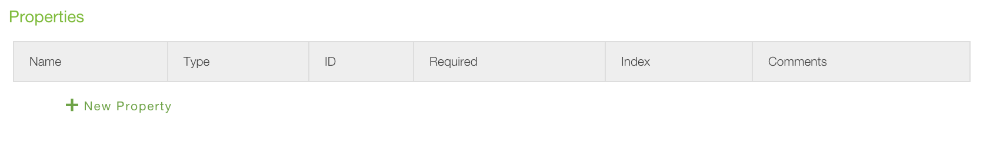

  Add each of these properties as described in the section and screenshot below:

     _id
     first_name
     last_name
     img
     job_title

  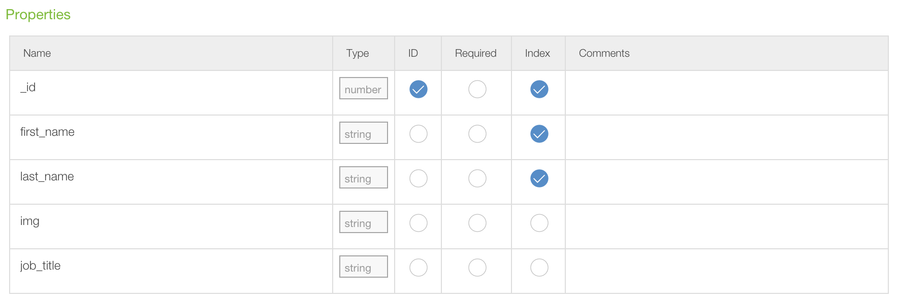

4. Click **Save Model**.

  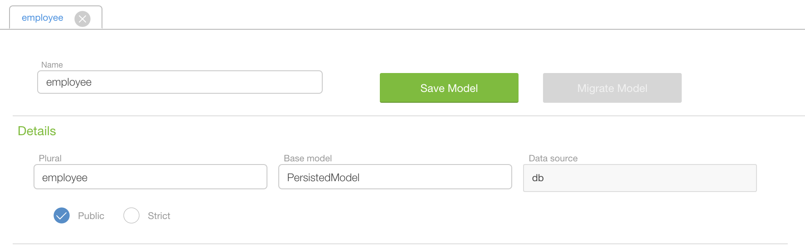

### Start and test the new API

Now let's test our services.  

1. In the terminal press the Ctrl+C to stop the StrongLoop arc, and run the following command to start the node.js application.

        node .

  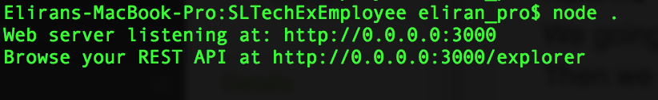

2. Open the browser and enter the following url :

        http://localhost:3000/explorer
     
  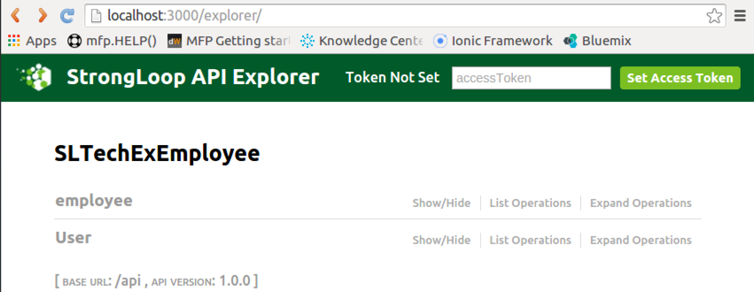

3. Click the **employee** link to view the Rest-API that was generate for us from our model

  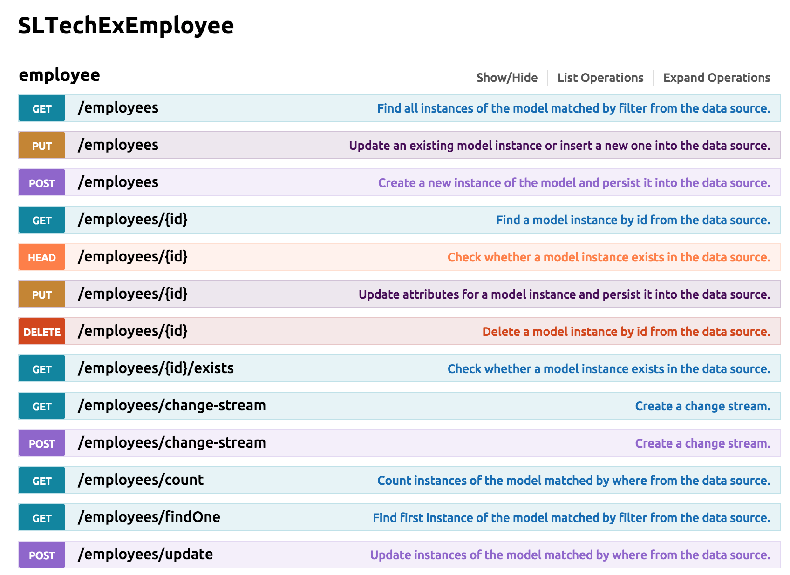

4. Test one of the REST APIs, "GET /employees". Click the **GET /employees** link in the swagger page and then click on the **Try it out!** button at the bottom of the section

  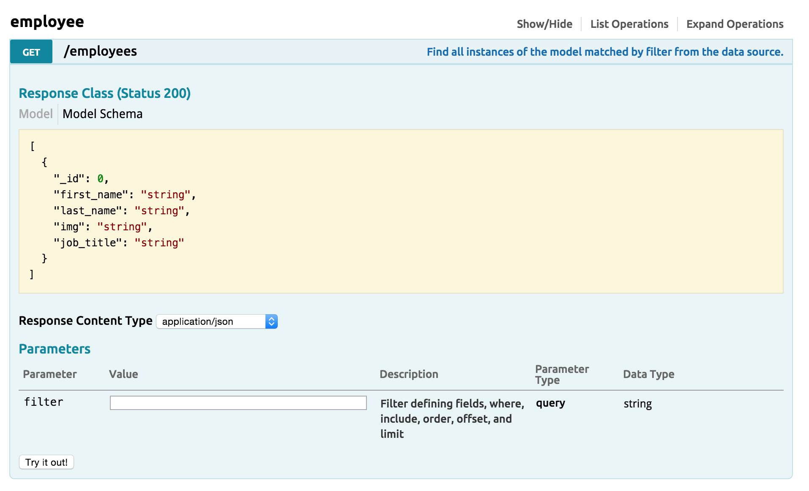

  As you can see we got an empty response - this is because we don’t have any employees in our list, lets use the POST API to add one.

5. Click the **POST /employees** link

  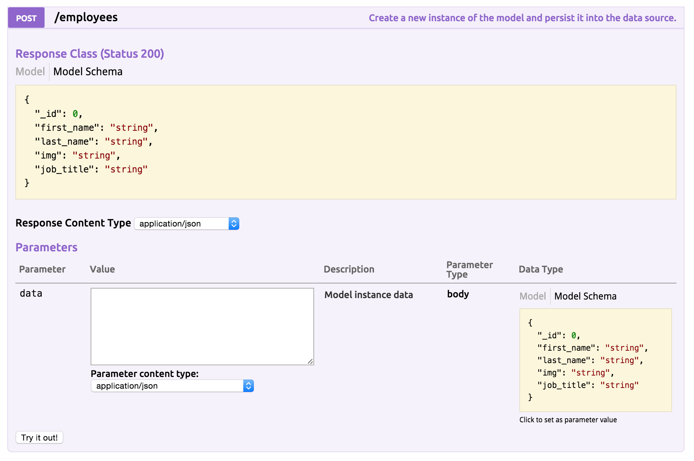

6. In the data text box enter the following (feel free to use your own name and data):

  ``` json     
  {
      "_id": 1000, 
      "first_name": "Eliran", 
      "last_name": "Ben Ishay", 
      "img": "", 
      "job_title": "Solution Architect" 
  }
  ```
  
7. Click the **Try it out!** button.

  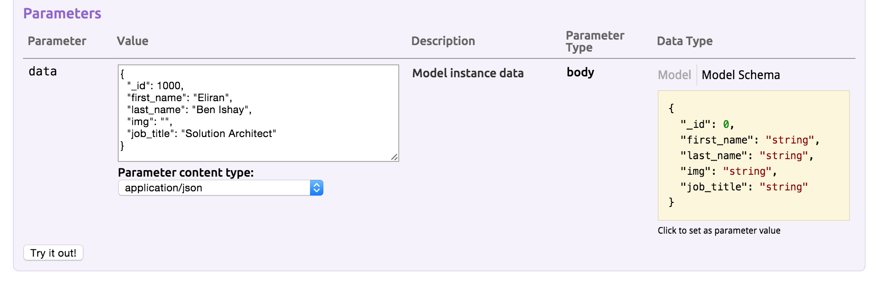

  You should see the response body with your employee data and the response code (200).

  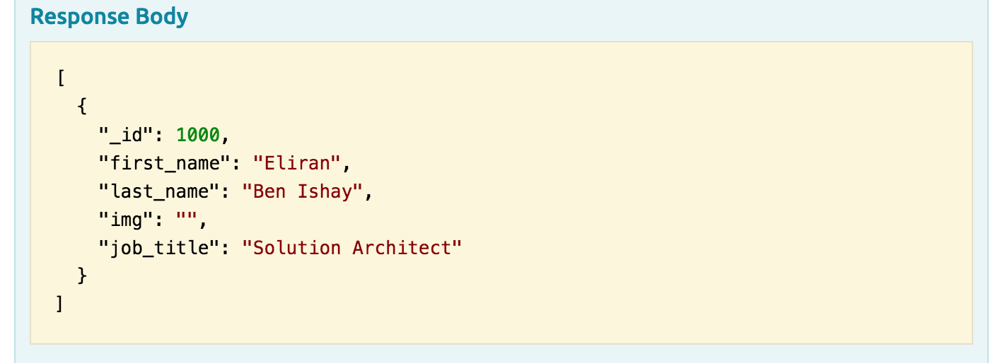

8.  Try the GET /employees call again - you should now see in the response body that you have an employee in your list. You can continue and add, remove, edit as many employees as you would like (but you might want to look at the next section before spending too much time adding users!).

### Persist the in-memory db to a file

If you stop the node service and restart at this point, you will find that the list of employees is empty again.  The in-memory connector allows us to use the data as long as the server is running, but if we want the data to persist we must save it to a database or to a file.  For simplicity, we will use a file.  

1. Navigate to **SLTechExEmployee/server/** and using your favorite Text Editor/IDE (If using the provided Virtual Machine, the Brackets editor is provided), open the datasource.json file.  Be sure to add the comma after "memory".

  Add the following code :

  ``` javascript
,
"file": "employee.json"
  ```

  **Before:**

  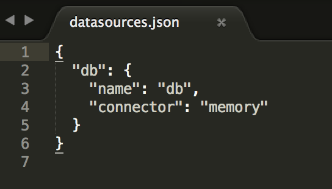

 **After:**

  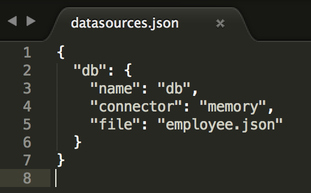

2. **Save** the file.
3. Stop the server by pressing **Ctrl+c** in the terminal window running node.
4. Restart the server

        node .

5. Add another user (or two).  Now when you stop and start your sever you will find that your data was saved to the employee.json file.

  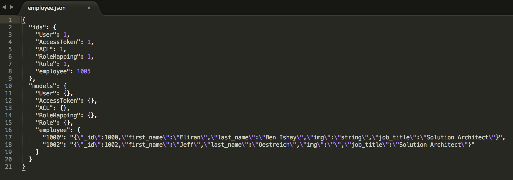


### Summary
Now that you have your services exposed using StrongLoop we will discuss/demo a variety of ways that you can extend your MobileFirst solution to include them with minimal effort, securely and with useful analytics. 

(Subsequent labs to follow)


### In case you got lost on the way

You can easily get to this stage by running the following command :

     git checkout -f step-10


