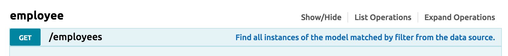
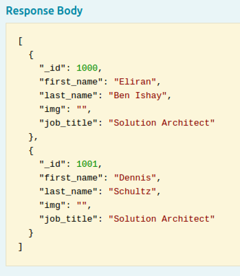
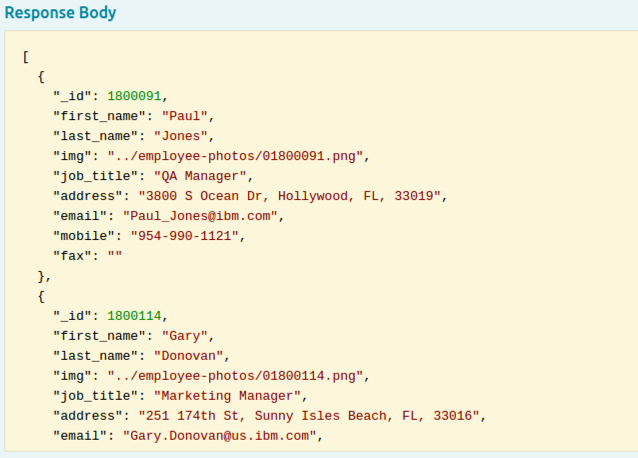
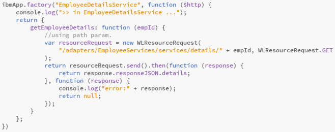
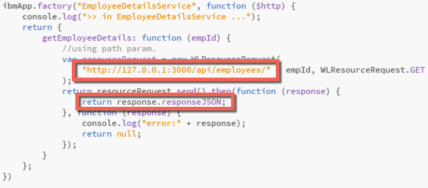
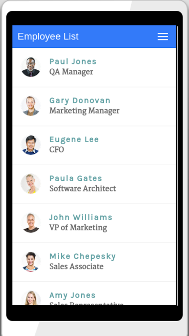
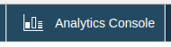
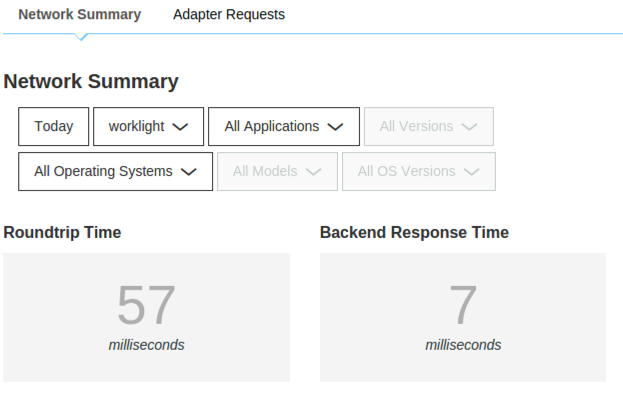

---
# Lab 11 - Connecting our mobile app to our StrongLoop API

In this lab we will access our REST API directly from our mobile app, with a simple change, and still leverage the features and benefits of being a MobileFirst Platform application.


### Populate the StrongLoop data source
Before we test our app against our StrongLoop API, we we need to populate our backend API with data.  Since we are using an in-memory datasource with a json file backing store, we could just replace the .json.  Instead we will use a node script to populate our data source through our RESTful API.

Lets get started :

1. Run the SL server, Navigate to your SL project folder and run the following command :
   
   ```
   cd ~/MobileRoadShow7.1/SLTechExEmployees
   node .
   ```
   
2. Open the browser and navigate to **http://127.0.0.1:3000/explorer**
   
   <!--   -->
   
   
3. Click the **employee -> Get** link
   
   <!--   -->
   
   
4. Click the **“Try it out”** button and make sure you get a list of employees as the results
   
   <!--   -->
   

   <!--   -->
   
   
   You should see just one or two results rows, based on what was manually created in the previous lab.  Now you will run a node script that will repopulate the employee list with data for the sample application.

5. Open a second Terminal and navigate to the **server** folder within the **SLTechExEmployee** StrongLoop app:    
   
        cd ~/MobileRoadShow7.1/SLTechExEmployee/server
   
6. Install node modules required to run the script.

        npm install async fs request
        
7. Copy the node script **import-employees.js** from the extras folder to the server folder
   
        cp ../../extras/import-employees.js .
   
   > NOTE: Feel free to explore this file and see what it does.
     
7. Issue the following command to invoke the *import-employees.js* script
   
        node import-employees.js
   
8. Return to your browser and press on the **“Try it out”** button again to GET employees. You should see a list of many more employees returned in the response.

       
       
### Modify the mobile application to call the StrongLoop API

Now that we have the SL API running and populated we will modify our IBMTechEXEmployee project using Brackets

1. Open the **/www/js/app.js** file and navigate to **EmployeeService** 

2. Modify the `WLResourceRequest` and change the url
    
    From :
    
    `/adapters/EmployeeServices/services/list`
    
    To :
   
    `http://127.0.0.1:3000/api/employees`
   
3. Modify the success call back and change the code
   
   From :
   
   `employees = response.responseJSON.employees;`
   
   To :
   
   `employees = response.responseJSON;`
   
   Your code should look like this :

   **Before :**

   <!--   -->
   
   
   **After :**
   
   <!--   -->
   

1. Navigate to **EmployeeDetailsService** 

2. Modify the `WLResourceRequest` and change the url

   From :
   
    `/adapters/EmployeeServices/services/details/ + empId`
   
   To :
   
    `http://127.0.0.1:3000/api/employees/ + empId`
   
3. Modify the success call back and change the code
   
   From :
   
   `return response.responseJSON.details;`
   
   To :
   
   `return response.responseJSON;`
   
   Your code should look like this :

   **Before :**

   <!--   -->
   
   
   **After :**
   
   <!--   -->
   
  
  
### Preview the application and review Analytics  
   
1. Return to a terminal prompt with context within **IBMTechEXEmployee** and run the application using the preview or the emulator 

        mfp corodva preview
   
   or
   
        mfp cordova emulate

   We should see our new list of employees coming from StrongLoop.     

   


2. Navigate the app screens several times to display the list of users, see user details, logout.  This will generate analytics data that we will see shortly.
   
3. If the Analytics console is open in the browser, refresh it.  Otherwise launch it by starting the Operations Console with
   
   `mfp console`

   Then launch the Analytics dashboard from the icon in the upper right and log in with admin/admin.
   
   

   
4. Review the operational analytics console to can see that we were able to collect metrics about the application usage and backend requests, even though it is not hosted within the server.

   


---
> Get pics of these:
> 
> Network - Roundtrip time and Backend response time.
> 
> Dashboard - Total sessions
> 
> Devices - Operating system usage, model usage, OS version usage.
  