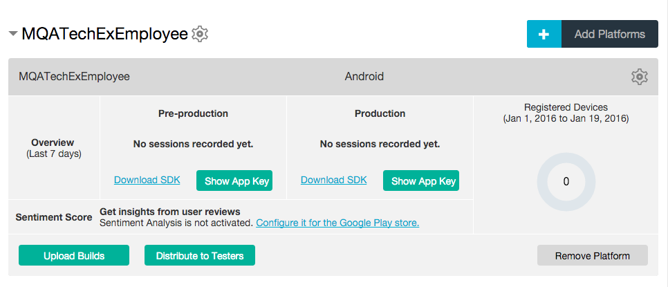

---
# Lab 12 - Instrumenting the Application with Mobile Quality Assurance (MQA)

In this lab we will add Mobile Quality Assurance (MQA) instrumentation into our application, using the MQA plugin for Cordova. This will allow the users of our app to record enhancement requests and bug reports directly from within the app with a simple shake gesture.  


### Register for a trial BlueMix account
MQA is delivered as a service on the IBM Bluemix cloud platform, so the first step will be to register for a trial BlueMix account, and enable the MQA service. 

Lets get started :

1. Open any browser, and navigate to **http://www.bluemix.net** 
   
   
 
2. Click the **GET STARTED FREE** button to begin the registration process.  (If you already have a Bluemix account, click the **Log in** button and enter your account credentials.)  This will bring up the Sign Up screen below.
   
   
   
3. Fill out the request form with your pertinent details, and click Create Account. This should present you with the Bluemix Console panel.  Take a second to note all the different services and runtime platforms that are supported in Bluemix.  We'll be creating a Mobile Quality Assurance service, so click the **Mobile** checkbox in the left-hand column to filter the list to just mobile services, then click the **Mobile Quality Assurance** icon.

   

4. In the next screen, just accept all the default values presented, and click **Create**.  We'll name the MQA application in the next set of dialog screens.

   

---
### Create a new Mobile Quality Assurance application
MQA applications have two separate modes of operation: Production and Pre-Production. The Production SDK is a more lightweight and less verbose version than Pre-Production. Use the Pre-Production SDK during Dev/Test/QA cycles, then replace it with Production before releasing the application for general use. 
   
1. Click **+ New MQA App**, then provide a name in the box that appears.  Call the app **MQATechExEmployee**, then click the **+ Add Platforms** button.

   
   
2. Since we're not working on Mac OS/X computers, we can't select iOS as a platform.  Select Android, and then press the **Submit** button.
   
   
     
3. The new MQA application should be created in just a few seconds, and the console will show a new statistics dialog for the **MQATechExEmployee** app. Notice the two separate areas, one for Pre-Production (Dev/QA/Test mode), and one for Production releases. For this exercise, we'll use the Pre-Production SDK.  Click the **Download SDK** link in the Pre-Production section to navigate to the IBM Knowledge Center, where we'll download the Cordova SDK. 
   
   
     
4. The SDK we need here is the last one in the list, the **Mobile Quality Assurance plugin for Apache Cordova for download**.  Select that link, then click the download link on the next page. The file **CordovaPlugin-3.0.16.zip** will automatically be saved into the \downloads folder in your VM.  We'll use this file later.

   
       
5. The last bit of information we need from the MQA console is the API key.  This links your mobile app to the MQA service running in Bluemix.  Go back to the MQA console, and click the **Show App Key** button in the Pre-Production section. Copy the entire string to the clipboard and paste it somewhere safe for use in the next section. 

   

---
### Modify the mobile application to add the MQA SDK plugin

Now that we've created the MQA service on Bluemix and downloaded the Cordova plugin, it's time to modify the application code to invoke the Mobile Quality Assurance API's.

1. Start by unzipping the CordovaPlugin-3.0.16 file in the ~/downloads folder. Open the Files app from the Launcher bar and navigate to the Downloads folder.  Right-click the CordovaPlugin-3.0.16 file, and select **Extract here**.   

   

2. There is one file in the Android Cordova project that needs to be renamed for this plugin to operate properly.  Open the Files app, and navigate to the folder: **/dev/workspaces/MobileRoadShow7.1/IBMTechEXEmployee/platforms/Android**.  Right-click on the file **custom_rules.xml** and rename it to **custom_rules.xml.bak**.


3. Open a terminal window and navigate to the **/dev/workspaces/MobileRoadShow7.1/IBMTechEXEmployee** folder (the client-side application), and enter the command:

	`mfp cordova plugin add ~/Downloads/CordovaPlugin-3.0.16/`
	
4. Lastly, open the **app.js** file in **IBMTechEXEmployee/www/js***.  We'll be adding the code that initializes the MQA session with the Bluemix server.  
5. Find the **wlCommonInit** method, and add the following code just after the call to **angular.bootstrap(document.body, ['ibmApp'])**, replacing the appKey and defaultUser values as necessary:
 
``` javascript

    MQA.startNewSession({
        mode: "QA",
        android: {
            appKey: "your_MQA_Android_appKey",
            notificationsEnabled: true
        },
        defaultUser: "your email address",
        reportOnShakeEnabled: true 
    }, {
        success: function () {
            console.log("MQA session started successfully");
        },
        error: function (string) {
            console.log("MQA session error" + string);
        }
    });

```

**Screen shot Before:**  

   

**Screen shot After:**  

   
    
**Save** your updates!


### Test the changes and create a Bug Report

1. Return to the command line and ensure you are in the `IBMTechEXEmployee` folder 

2. Run the application using

        mfp cordova emulate -p android
        
3. When the application launches for the first time, you'll be presented with a new set of screens that walks through the MQA reporting features.  You can either click **Next** to see each screen in succession, or click **Skip** to exit to the login screen.

     
      
4. Unfortunately, the Android emulator is not capable of simulating the "shake" gesture, but there is an alternate method of entering the MQA reporting dialog.  In the title bar of the app, look for the two dots near the upper left side. Click the second dot and drag down to show the MQA menu.

     

5. Click the first option - **Tap to report problem or give feedback**  At this point, you can either report a bug, or simply provide feedback on the application.  Click the **REPORT A BUG** option to continue.

6. Fill out the three text fields and select an appropriate severity level, then scroll down to the attachment section.

    
   
7. MQA will automatically attach an image of the screen that was active when the Bug Report was started.  Click the **Edit** button underneath the image to annotate the image with lines and hand-written text, using your mouse to "draw" on the screen.  When completed with any annotations, click **DONE** to save them.  The **Add New** button allows you to add additional images, if necessary.

8. When completed, click **SEND** to file the bug report to the MQA service on Bluemix.

9. Finally, return the Bluemix console in the browser and refresh the screen.  You should see the "Bugs" count has incremented by 1.  Click the number above **Bugs** to see the filed bug report, as shown below.  You can also review the **Sessions** page to drill down into active user sessions.

    
   


