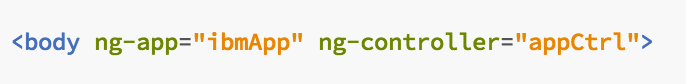
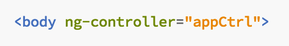
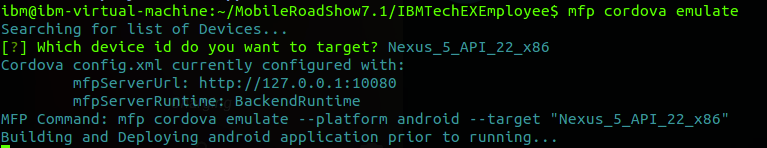
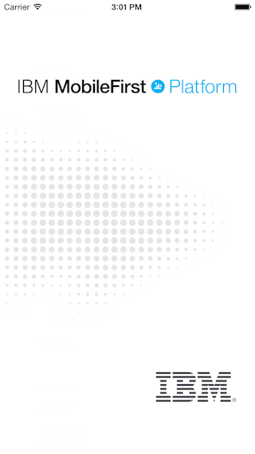
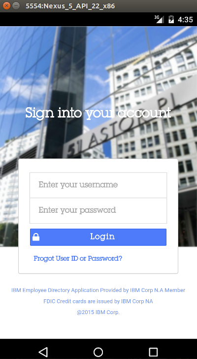

- - -
# Lab 3 - Load MFP framework and application Bootstrapping

At this point, you have a MobileFirst Cordova application project, with Ionic-built application logic.  Unfortunately, when we replaced the /www folder during Lab2, we "lost" the MFP JavaScript that enables basic MobileFirst capabilities.  This MFP JavaScript code was included in the default application created by the 'mfp cordova create' step, which is now in your renamed `/tmp` folder.  

In this lab, you will add this MFP JavaScript code to the Ionic application source and bring up the new application in an emulator.  

>Note:  For this lab there are snippets files included in the **/snippets** folder of your workspace which can be used to quickly copy/paste the large source code blocks below.

##Steps

1.  Open the **IBMTechEXEmployee** project using your favorite IDE. You are going to copy some code from the saved `tmp/js/index.js` file to the `app.js` file in your MobileFirst project.

  > Note:  You may use any IDE you like to perform the labs.  The examples shown use the Brackets IDE.

2. Open the **`app.js`** file in the folder **`IBMTechEXEmployee/www/js`** and add the following code immediately after the declaration of ibmApp and just before the comment “//application config":

   ``` javascript
  
     //Adding support for cordova.
         ibmApp.run(function($ionicPlatform) {
               console.log('>> ibmApp.run ...');
               $ionicPlatform.ready(function() {
                 // Hide the accessory bar by default (remove this to show the accessory bar above the keyboard
                 // for form inputs)
                 console.log('>> ibmApp.ready ...');
                 if (window.cordova && 
                     window.cordova.plugins && 
                     window.cordova.plugins.Keyboard) {
         			    cordova.plugins.Keyboard.hideKeyboardAccessoryBar(true);
                 }
                 if(window.StatusBar) {
                   StatusBar.styleDefault();
                 }
               });
             });

   ```


3. Within **`app.js`** scroll to the very bottom of the file and add the following code (locate snippet for copy/paste in the **/snippets** folder):


   ``` javascript

   //Adding MobileFirst
    var Messages = {
        // Add here your messages for the default language.
        // Generate a similar file with a language suffix containing the translated messages.
        // key1 : message1,
    };
   
    var wlInitOptions = {
        // Options to initialize with the WL.Client object.
        // For initialization options please refer to IBM MobileFirst Platform Foundation Knowledge Center.
    };
   
    // Called automatically after MFP framework initialization by WL.Client.init(wlInitOptions).
    function wlCommonInit(){
        // Common initialization code goes here
        console.log('MobileFirst Client SDK Initilized');
        angular.element(document).ready(function() {
            mfpMagicPreviewSetup();
            angular.bootstrap(document.body, ['ibmApp']);
        });
    }
   
    function mfpMagicPreviewSetup(){
        //nothing to see here :-), just some magic to make ionic work with mfp preview, similar to ionic serve --lab
        if(typeof WL !== 'undefined' && WL.StaticAppProps && WL.StaticAppProps.ENVIRONMENT === 'preview'){
            //running mfp preview (MBS or browser)
            if(WL.StaticAppProps.PREVIEW_ENVIRONMENT === 'android'){
                document.body.classList.add('platform-android');
                ionic.Platform.setPlatform("android");
            } else { //then ios
                document.body.classList.add('platform-ios');
                ionic.Platform.setPlatform("ios");
            }
        }
    }
   
    // Useful for ionic serve when MFP Client SDK is not present and wlCommonInit doesn't get called automatically
    var serveTimeout = 1500;
    window.setTimeout(function(){
        if(typeof WL === 'undefined'){
            console.log('MFP Client SDK timeout, running Web App');
            angular.bootstrap(document.body, ['guardianApp']);
        }
        }, serveTimeout);
   
   ```

4. Open the **`IBMTechEXEmployee/www/index.html`** file and remove the ng-app tag from the html body tag.

   Before :
   
   
   
   After:
   
   

5. The original MFP Cordova project also contained a thumbnail image used by the MFP Console.  Copy the image file from /tmp/img/thumbnail.jpg into /www/img/thumbnail.jpg.  This is not critical, but will avoid a CLI message in later steps.  Use the Files app or the `cp` command in the terminal to copy from `IBMTechEXEmployee/tmp/img/thumbnail.png` to `IBMTechEXEmployee/www/img/thumbnail.png`


### Preview the application


There are two options available to preview the application :

- Use the **mfp cordova emulate** command 
  - The emulate command launches an android virtual device or Xcode iOS simulator       
- Use the **mfp cordova preview** command.  
  - The preview command provides options of: 
       - Simple browser rendering or 
       - Mobile Browser Simulator rendering

The **mfp cordova preview** command provides easy preview, testing, and debugging of applications using the embedded browser debugger. The Mobile Browser Simulator feature also supports many Cordova device emulation controls for items such as GPS and accelerometer.  However, this requires the creation of a corresponding MobileFirst backend project.  We will get to that in the next lab, so for now you will use the emulate command.

1. Use the mfp cordova emulate command which will allow you to choose between the platform you choose to add:
android or iOS.  
  > Note that iOS will only be available if you are working from a machine running OS X.  

        mfp cordova emulate

  Selecting a mobile platform allows you to then select a specific device.  The list of available devices will depend on the type of host machine you are running on and which Android Virtual Devices are installed.
  > Note: If you are running on the provided VM, you will only have the **Nexus\_5\_API\_22\_x86** device available.

  

2.  In a few moments, the application will start up in an Android emulator window.


    

3. Close the Emulator when finished.

##Summary
In this lab, you enabled the MobileFirst project to use the services provided by the platform by adding code to the main app.js file.  Additionally, you added code to bootstrap Cordova.

If you were unable to complete this lab, you can catch up by running this command:

     git checkout -f step-3
     

.

   