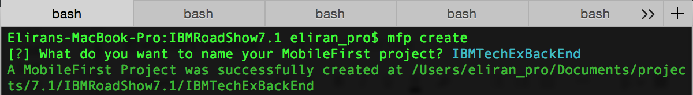
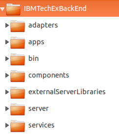
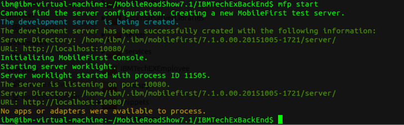
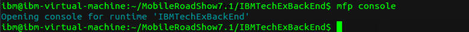
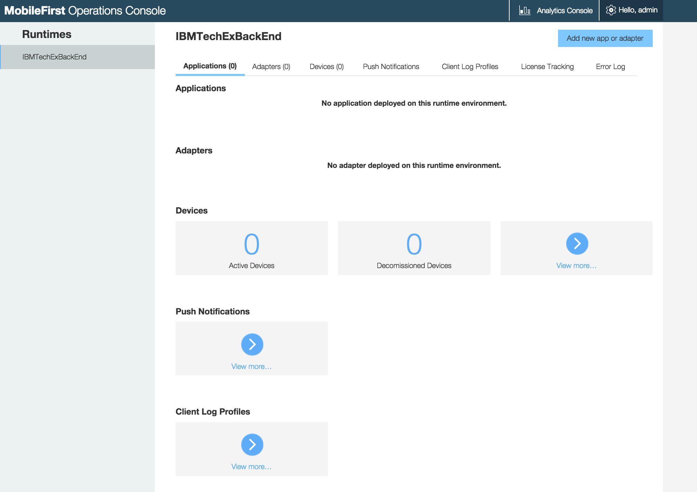
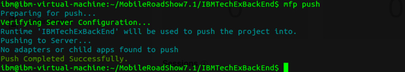
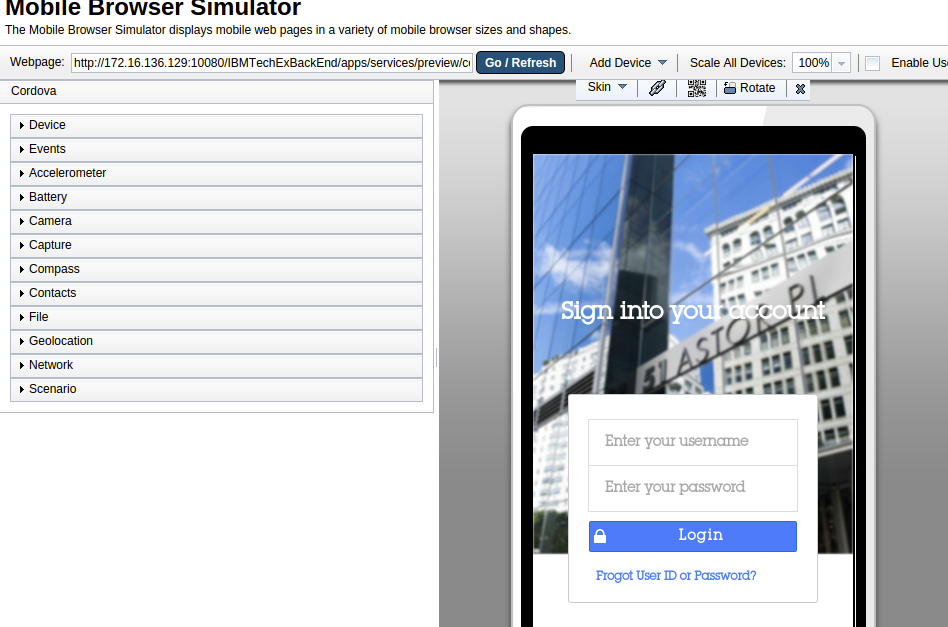

- - -
# Lab 4 - Add the MFP Backend project and preview your application

One of the components provided with the MobileFirst Platform is the Mobile Browser Simulator (MBS).  MBS can also be used to preview the application.  In contrast to the `mfp cordova emulate` command, the `mfp cordova preview` command does not require a platform emulator (such as Android Virtual Device) - it operates entirely in the browser.  The simulator also enables you to leverage browser developer tools such as the debugger, style editor and inspector.

The Mobile Browser Simulator requires a MobileFirst backend project and MFP development server to operate.  The backend project will be deployed onto the MFP development server and will enable you to use the adapter framework and the built-in management capabilities and analytics capabilities of the MFP server.

##Steps
1. Change your directory context to MobileRoadShow7.1.

        cd ..
        
2. Create a new MobileFirst project for the backend.

        mfp create

  When prompted, provide the name **`IBMTechExBackEnd`** for the project name.

  

  Your project should look like this :

  

3. Within the terminal navigate to the **`IBMTechExBackEnd`**.

        cd IBMTechExBackEnd

4. The MobileFirst Platform CLI comes with a Development server based on Liberty that you can use to test the backend components of your application.  Start the **MFP Development Server**.  Note that if the server does not yet exist, it will be created the first time you invoke this command.

        mfp start

  You should get the following message :

  

5. The Operations Console is a browser-based interface through which you can manage artifacts deployed to your server.  View the **Operations Console** by running

        mfp console

  

  
  
  The Operations Console indicates that there are no applications nor adapters deployed yet.  You will deploy your artifacts in the next steps.

6. **Close** the browser

7. Push the backend application to the MFP server.

        mfp push

  

8. Navigate back to the **IBMTechEXEmployee** directory.

        cd ../IBMTechEXEmployee
        
9. Preview the app

        mfp cordova preview

  1. When prompted, use the arrow keys and spacebar on your keyboard to select **`mbs: Mobile Browser Simulator`** and press **Enter**.
  
  2. When prompted, select the **`android`** platform and press **Enter**.
  
  The default browser should be launch and you should see the following screen

  
 
  The Mobile Browser Simulator provides methods to interact with your app through Cordova.  Using the menus on the left side of the browser window, you can control interfaces such as Geolocation, Accelerometer and Network.

3. Close the browser.
  
##Summary
In this lab, you created a new MobileFirst project that will include the back end components of your application, such as adapters.  

You also used the MobileFirst Mobile Browser Simulator to test your application.

If you were unable to complete this lab, you can catch up by running this command:

     git checkout -f step-4