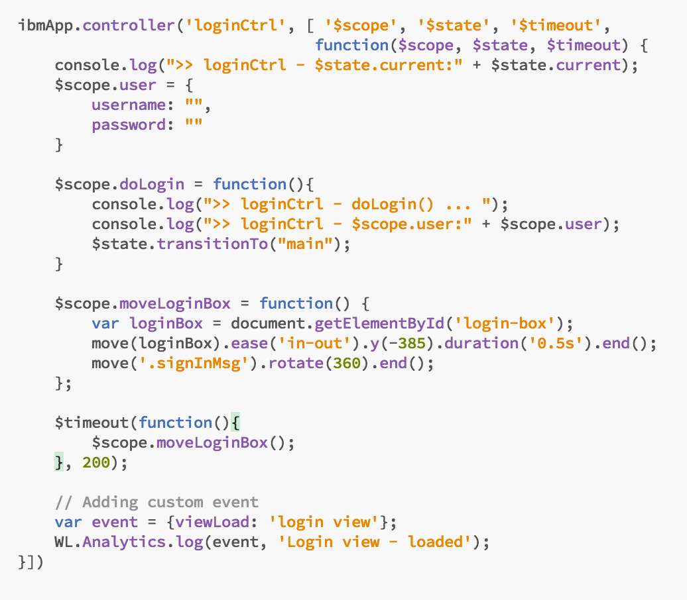
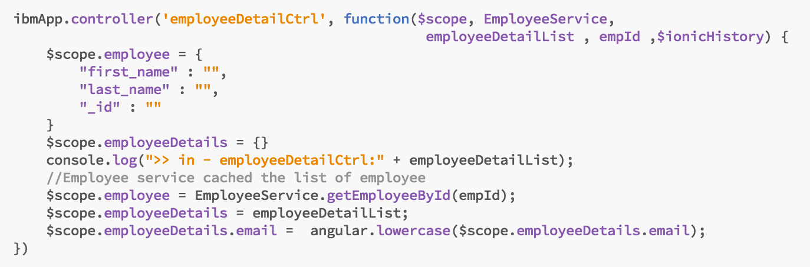
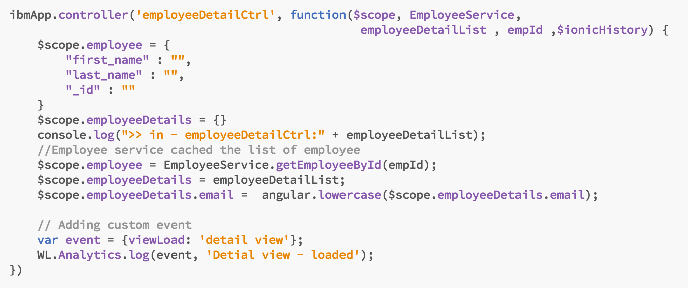
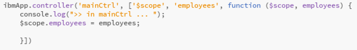
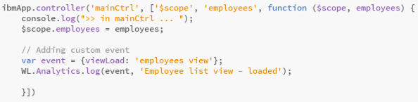
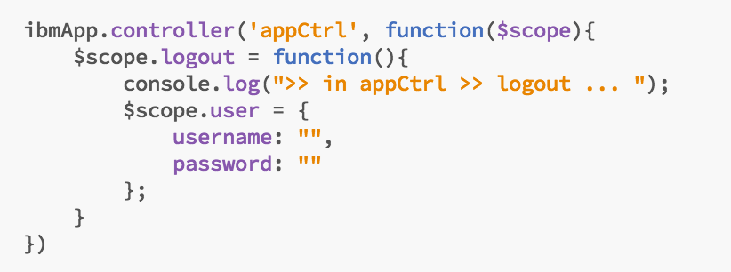
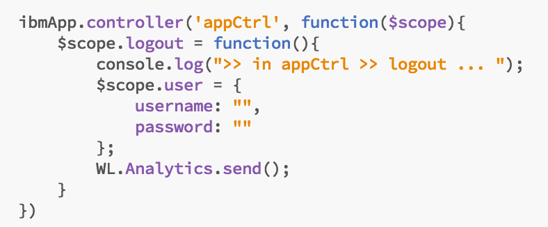

- - -
# Lab 8 - How to capture custom events

As has been mentioned earlier, the MobileFirst Platform provides the ability to generate custom log events, which can be used to provide a better understanding of how your users are interacting with an application.  

In the following lab, we will explore the logging API and add it to our application in several key places.  The logged events will be collected by the Analytics server, and will be available for inspection and charting to give us very specific insight into usage patterns by our community.

### Add WL.Analytics.log() calls to the controller logic in app.js

Open the app.js file.

With angular / ionic MVC processing, a controller is called each time the view is loaded by user navigation.  In our app we have 3 views - login, main (or employee), and details, along with 3 controllers - loginCtrl, mainCtrl, and employeeDetailCtrl.  We will add our logging event to each controller, capturing an event each time one of these views is loaded.

Modify the controller code in app.js and add the following code, which will log the **‘viewLoad’** event with the name of the view (login view in this screenshot):

Start with the **loginCtrl** and add the custom event logic to the bottom of the controller block to log entry into the login view.  Your code should look like this

Repeat for **employeeDetailCtrl**, changing the view name in the logged message from "login" to "detail" as shown in the after block below.  This message will log each time the details.html view is displayed.

**Before**

**After**

Repeat once more for **mainCtrl**, which is called every time the employee.html (employee list) view is displayed. *Make sure you change the log message to reference the employee view as shown in the after block below*:

**Before**

**After**

### Add WL.Analytics.send() to push queued events to the server

The MobileFirst client will automatically forward collected log messages when the log threshold is reached, but for this exercise we would like to push them to the mfp server as soon as they are logged, so that we can see them immediately and continue with creating our custom charts.

Add `WL.Analytics.send();` to the appCtrl controller, below the $scope.logout function.

 **Before**

 
 **After**
 

#### Save your changes!  

In the next lab, we will run the app to generate the data, then use the Analytics console to create a custom chart showing the distribution of views being loaded.

---

### Summary

With these simple additions, your application now delivers custom events to the MFP Analytics server to track usage patterns in the application and help with problem diagnosis, usability and app health.

### In case you got lost on the way

You can easily get to this stage by running the following command :

     git checkout -f step-8
     